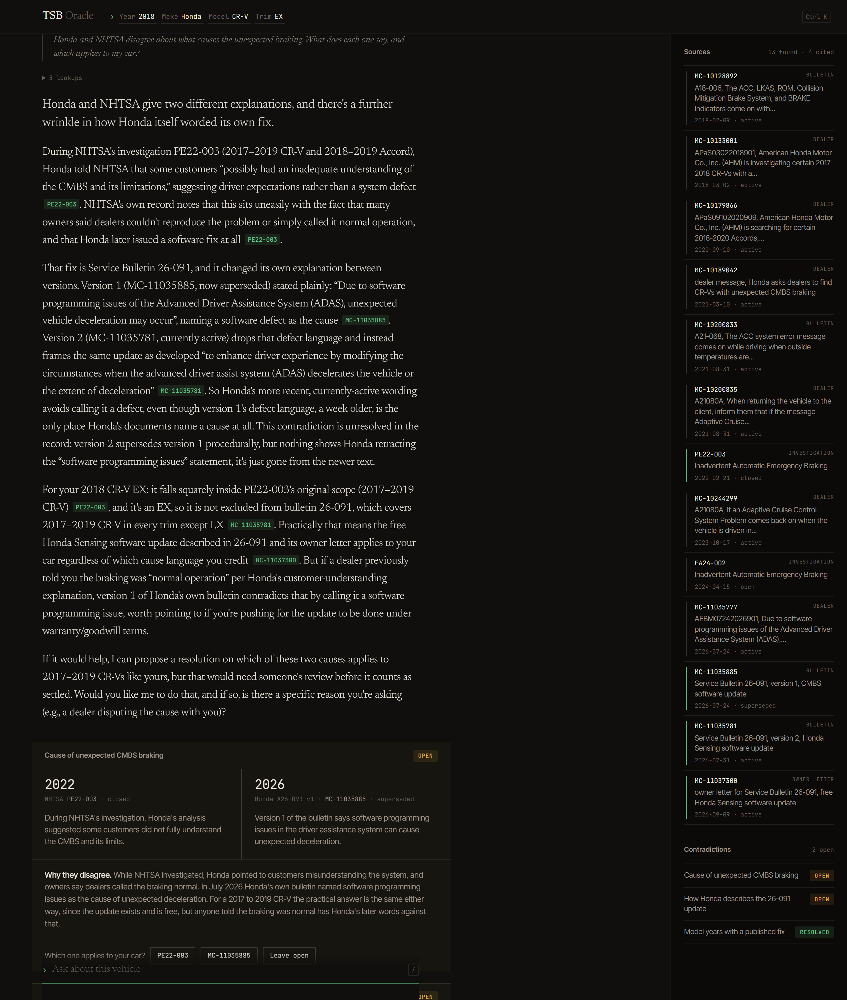
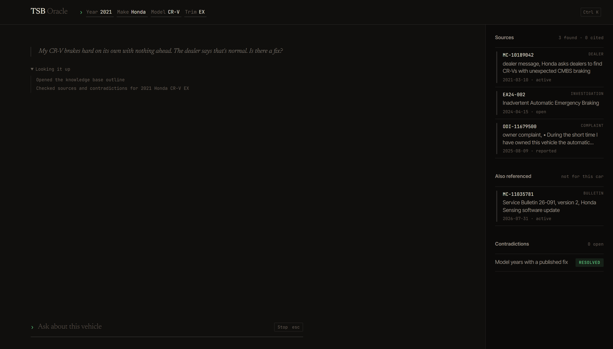
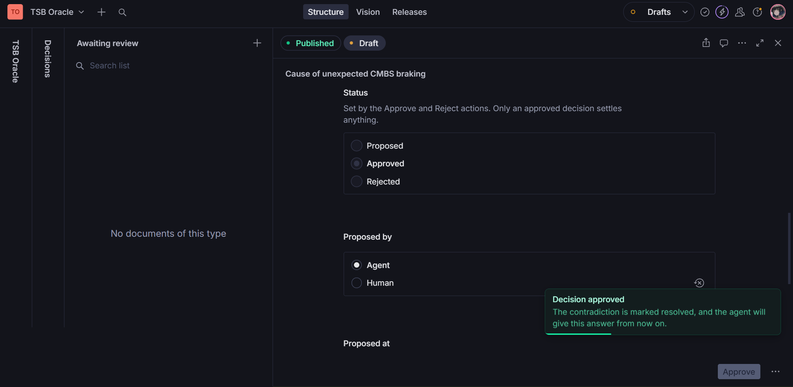

# TSB Oracle

[](https://github.com/pyarchana/tsb-oracle/actions/workflows/ci.yml)
[](LICENSE)
[](https://tsb-oracle.vercel.app)
[](https://www.sanity.io)

**Car repair answers that cite their sources and show you where those sources
disagree.**

[Live demo](https://tsb-oracle.vercel.app) · Sanity project `e72p6sym`, dataset
`production`

## Description

Ask about a fault on your car and the public record contradicts itself. A
bulletin names a cause, and its revision a week later quietly drops that
sentence. A federal investigation covers 2017 to 2022 while the manufacturer's
fix stops at 2019. Owners report that the dealer called it normal. All of it is
true at once, and a search engine hands you whichever page ranks best.

TSB Oracle retrieves all of it instead. Every sentence in an answer carries the
NHTSA id it came from, quotes are verified against the document they are
attributed to, and when two sources disagree about your exact car, the
disagreement is laid out rather than resolved by guesswork. A person can then
settle it, and the settled answer is what the next person gets.

The demo dataset is one vehicle and one system, built from real NHTSA records:
unexpected automatic emergency braking on the 2017 to 2022 Honda CR-V.

## Visuals

An answer, its citations, and the contradiction it raised:



What the agent read, while it is still reading:



A proposal from the agent, approved by a person in the Studio:



## Table of contents

- [Features](#features)
- [Tech stack](#tech-stack)
- [Installation](#installation)
- [Usage](#usage)
- [How it works](#how-it-works)
- [Contributing](#contributing)
- [License](#license)
- [Acknowledgements](#acknowledgements)

## Features

- **Answers only from retrieved sources.** Nothing it cannot cite, and a plain
  "I don't have sources for that" when the dataset is silent.
- **Citations that link to the record.** Each chip opens the NHTSA document it
  refers to.
- **Two checks on every answer.** A citation the agent never retrieved is
  flagged amber. A quote is verified against the dataset's copy of the document
  it is attributed to, which caught version 1 wording cited to version 2 during
  testing.
- **Contradictions shown, not hidden.** Both claims, their dates, and a plain
  explanation of why they conflict.
- **Proposals, not decrees.** The agent proposes a resolution; a person
  approves or rejects it in the Studio before it counts.
- **Keyboard first.** `/` to ask, `Ctrl K` or `Cmd K` for the vehicle, Escape
  to back out or to stop an answer.

## Tech stack

| Layer | Choice |
|---|---|
| App | Next.js 16 (App Router), React 19, TypeScript |
| Styling | CSS Modules over Tailwind 4's reset |
| Content | Sanity, with the Studio embedded at `/studio` |
| Retrieval | Sanity Context MCP over a Knowledge Base |
| Agent | Vercel AI SDK tool-calling loop, Claude Sonnet |
| Hosting | Vercel |

## Installation

```bash
git clone https://github.com/pyarchana/tsb-oracle.git
cd tsb-oracle
npm install
cp .env.example .env.local
```

Fill in `.env.local`:

| Variable | Needed for |
|---|---|
| `ANTHROPIC_API_KEY` | the agent |
| `NEXT_PUBLIC_SANITY_PROJECT_ID` | reading content |
| `NEXT_PUBLIC_SANITY_DATASET` | reading content |
| `SANITY_API_TOKEN` | the import, the seed, and writing proposals |
| `SANITY_CONTEXT_MCP_URL` | the Knowledge Base |
| `SANITY_ORGANIZATION_TOKEN` | the Knowledge Base |

Then load the data and start it:

```bash
npm run import:nhtsa   # real NHTSA records, no API key needed
npm run seed           # claims and contradictions on top
npm run dev
```

App at http://localhost:3000, Studio at http://localhost:3000/studio.

Without the two Context variables the agent falls back to fixtures in
`lib/context-mcp/fixtures.ts` and logs a warning. That is enough to develop
against, but it is not the Knowledge Base.

Deploying is covered in [docs/deploying.md](docs/deploying.md), including the
CORS origin the sources panel needs.

## Usage

The demo car is a 2021 Honda CR-V EX. Change the tokens in the header for the
rest.

| Vehicle | Ask | What it demonstrates |
|---|---|---|
| 2021 CR-V EX | My CR-V brakes hard on its own with nothing ahead. The dealer says that's normal. Is there a fix? | a coverage gap, already settled by review |
| 2018 CR-V LX | Does Service Bulletin 26-091 apply to my car? | a trim exclusion |
| 2018 CR-V EX | Honda and NHTSA disagree about what causes the braking. Which applies to my car? | an open contradiction, and a proposal |
| 2018 CR-V EX | Is the software update free, and how long does it take? | a plain answer from the owner letter |
| 1994 Civic del Sol | Are there any recalls for this car? | no sources, and it says so |

Keyboard: `/` focuses the question, `Ctrl K` or `Cmd K` jumps to the vehicle and
selects the year, Enter applies it, Escape abandons an edit or stops an answer
in progress.

Scripts:

```bash
npm run dev            # dev server
npm run build          # production build
npm run lint           # eslint
npm run import:nhtsa   # refresh source documents from NHTSA
npm run seed           # rewrite claims and contradictions, keeps review status
```

Each question is a live model call, so the hosted demo stops answering when the
API balance behind it runs out.

## How it works

```
question ─→ agent loop (Claude, AI SDK)
              ├─ initial_context / knowledge_base_read  → Sanity Context MCP
              ├─ check_applicability                    → GROQ over the dataset
              └─ record_decision                        → writes a proposal
            ↓
         answer ─→ citation check, quote check ─→ chips, flags, conflict block
```

Four content types carry the work: `tsb` for a source document, `claim` for one
statement with the words it rests on, `contradiction` for two claims that
disagree, and `decision` for a resolution awaiting review. The Knowledge Base
gives the agent the wording. GROQ gives it the structure: which model years a
document covers, which trims it leaves out, and what is still unsettled.

Further reading: [the data](docs/data.md) ·
[the Knowledge Base](docs/knowledge-base.md) ·
[decision review](docs/decisions.md) · [deploying](docs/deploying.md)

## Contributing

Issues and pull requests are welcome at
[github.com/pyarchana/tsb-oracle](https://github.com/pyarchana/tsb-oracle).

Before opening a pull request:

```bash
npx tsc --noEmit
npm run lint
npm run build
```

Commits stay small and say why the change was made, not what the diff already
shows.

## License

[MIT](LICENSE).

The records are NHTSA's public data. Honda's bulletins remain Honda's
copyright, so documents link to the copy NHTSA hosts rather than reproducing
it. This is not repair advice: whether a bulletin applies to a particular car is
decided by a dealer's VIN check.

## Acknowledgements

- [NHTSA](https://www.nhtsa.gov) for publishing the records this is built on
- [Sanity](https://www.sanity.io) for the content backend and Context
- The owners who filed the complaints that make the pattern visible

---

Built by [Archana](https://github.com/pyarchana) ·
Co-author of this project: Claude Opus 5, via Claude Code
